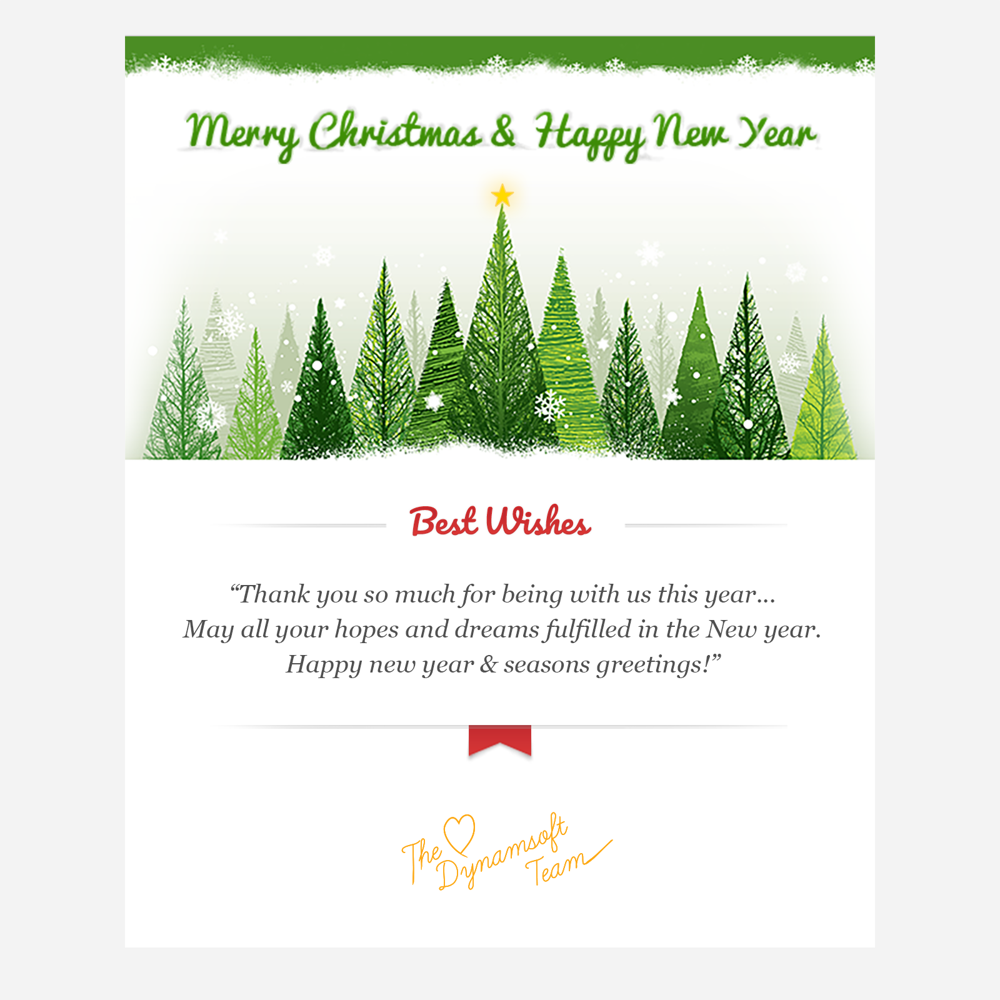
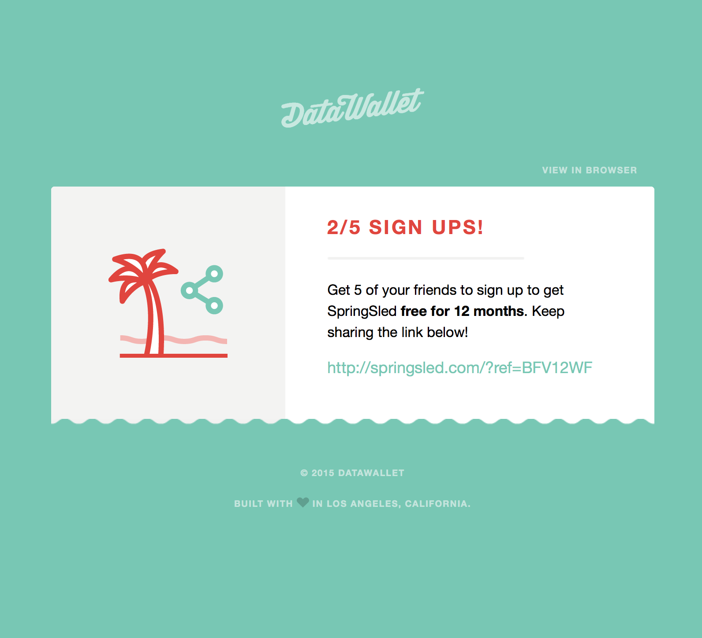
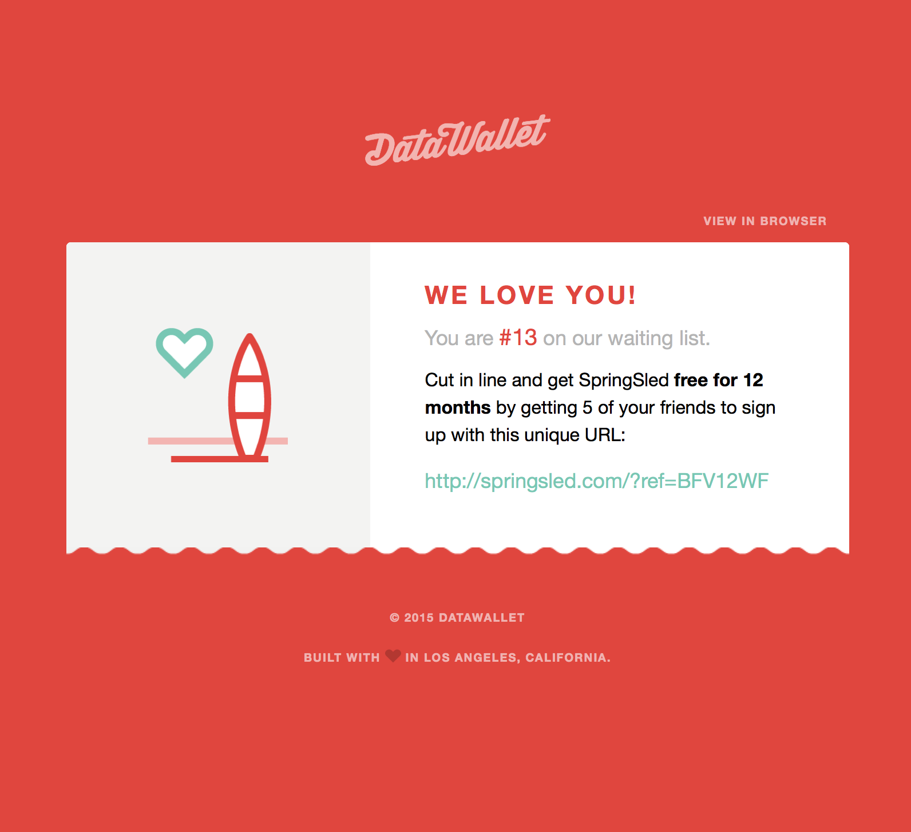
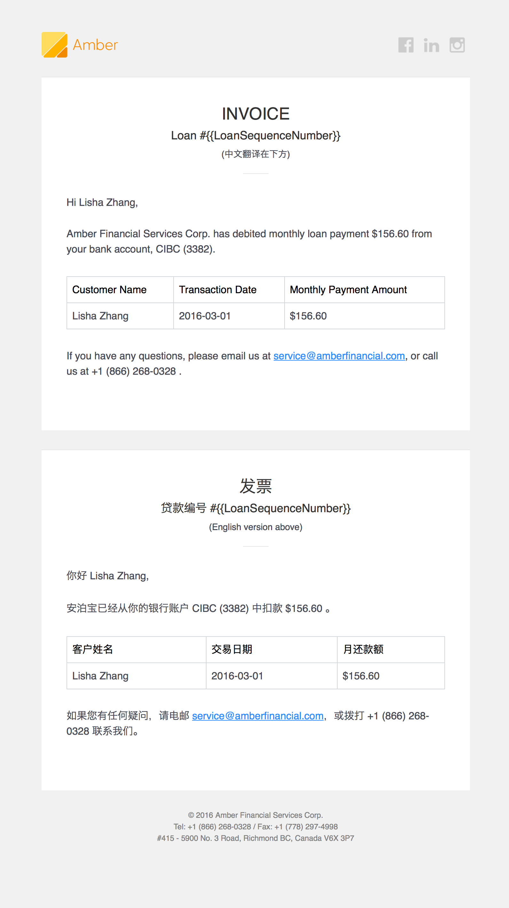
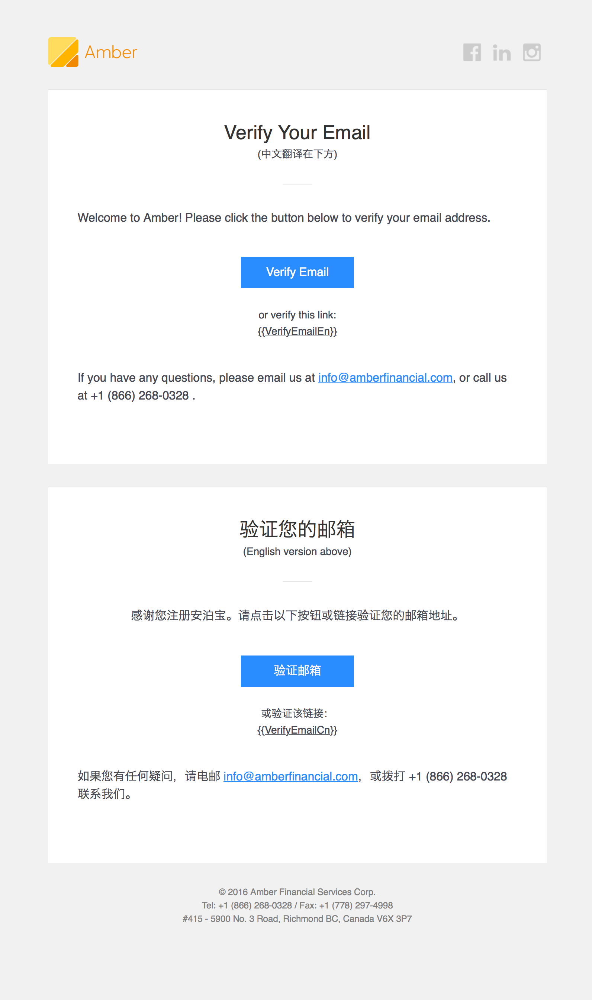
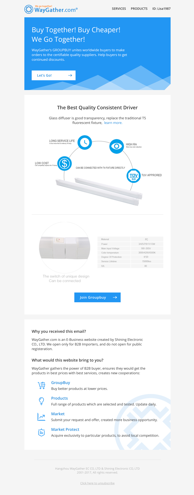
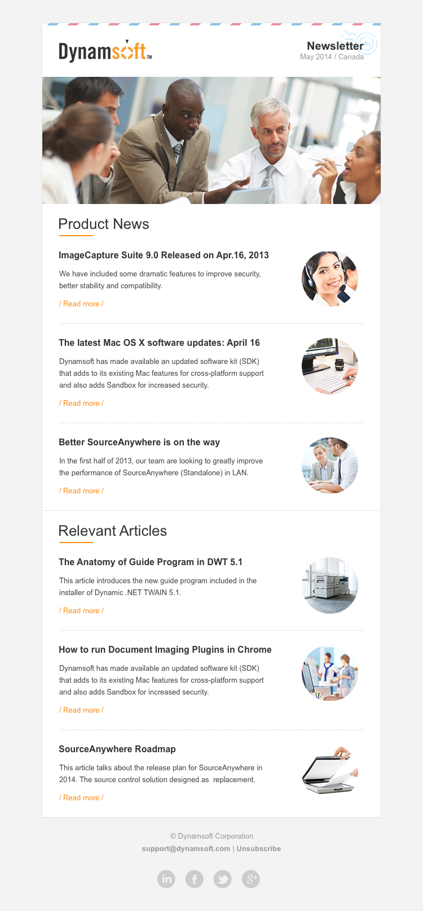

# HTML Email Templates

## Introduction

Well commented responsive HTML email templates. `<table>`-based.

Written with table and inline styles to achieve responsibility, while ensuring maximum compatibility with mainstream email clients, including GMail, Outlook, Apple Mail, Yahoo, QQ Email etc. No `
`, `
` or any naughty tags.

## Some Email Screenshots

Dynamsoft New Year Greetings 2013 | Dynamsoft New Year Greetings 2012
:---:|:---:
 | 

DataWallet Get Friends to Signup | DataWallet You Are in Waiting List
:---:|:---:
 | 

Amber Customer Payment Invoice | Amber Email Verification
:---:|:---:
 | 

<table>
<tr><th>WayGather Verify Account</th><th>Dynamsoft NewsLetter</th></tr>
<tr><td width="50%"></td><td width="50%"></td></tr>
</table>
